<p align="center">
  
</p>

<h1 align="center">Kyystore - Sistem Enkripsi Data Pelanggan</h1>

<p align="center">
  <strong>Tugas Mata Kuliah Kriptografi</strong><br/>
  Implementasi Enkripsi Data Pelanggan Menggunakan AES-256-GCM
</p>

<p align="center">
  
  
  
  
</p>

---

## 📋 Daftar Isi

- [Tentang Project](#-tentang-project)
- [Fitur Utama](#-fitur-utama)
- [Teknologi](#-teknologi)
- [Arsitektur Sistem](#-arsitektur-sistem)
- [Data yang Dienkripsi](#-data-yang-dienkripsi)
- [Algoritma AES-256-GCM](#-algoritma-aes-256-gcm)
- [Flowchart Sistem](#-flowchart-sistem)
- [Screenshot Aplikasi](#-screenshot-aplikasi)
- [Cara Menjalankan](#-cara-menjalankan)
- [Struktur Project](#-struktur-project)
- [API Endpoints](#-api-endpoints)

---

## 📖 Tentang Project

**Kyystore** adalah aplikasi web yang mendemonstrasikan implementasi enkripsi data pelanggan menggunakan algoritma **AES-256-GCM** (Advanced Encryption Standard dengan Galois/Counter Mode). Project ini dibuat untuk memenuhi tugas mata kuliah **Kriptografi**.

### Latar Belakang

Dalam era digital, keamanan data pelanggan menjadi prioritas utama. Data sensitif seperti:
- **Nomor Induk Kependudukan (NIK)**
- **Informasi Kartu Kredit**
- **Data Pribadi Lainnya**

harus dilindungi dengan enkripsi yang kuat untuk mencegah pencurian identitas dan fraud.

### Solusi

Aplikasi ini mengimplementasikan **AES-256-GCM** yang merupakan standar enkripsi yang direkomendasikan oleh **NIST** (National Institute of Standards and Technology) karena:

1. **Authenticated Encryption** - Menjamin kerahasiaan dan integritas data
2. **Galois/Counter Mode** - Lebih cepat dan aman dibanding CBC
3. **256-bit Key** - Virtually unbreakable dengan teknologi saat ini

---

## ✨ Fitur Utama

| Fitur | Deskripsi |
|-------|-----------|
| 🔐 **Enkripsi AES-256-GCM** | Data sensitif dienkripsi dengan algoritma terkuat |
| 👤 **Single Login Panel** | Satu form login untuk user dan admin |
| 📝 **Form Registrasi Lengkap** | Input data pribadi dan kartu pembayaran |
| 💳 **UI Kartu Kredit Realistis** | Tampilan kartu seperti asli |
| 👨‍💼 **Admin Dashboard** | Monitor data pelanggan terenkripsi |
| 🔄 **Toggle Encrypt/Decrypt** | Tampilkan data encrypted atau decrypted |
| 🔑 **JWT Authentication** | Autentikasi aman dengan token |
| 🔒 **Password Hashing** | bcrypt dengan 10 rounds |

---

## 🛠 Teknologi

### Backend
| Teknologi | Fungsi |
|-----------|--------|
| **Node.js** | Runtime JavaScript |
| **Express.js** | Web framework |
| **crypto** | Modul enkripsi AES-256-GCM |
| **bcryptjs** | Password hashing |
| **jsonwebtoken** | JWT authentication |

### Frontend
| Teknologi | Fungsi |
|-----------|--------|
| **React 18** | UI library |
| **Vite** | Build tool |
| **TailwindCSS** | Styling |

### Keamanan
| Komponen | Spesifikasi |
|----------|-------------|
| **Enkripsi** | AES-256-GCM |
| **Key Size** | 256 bits (32 bytes) |
| **IV Size** | 96 bits (12 bytes) |
| **AuthTag** | 128 bits (16 bytes) |
| **Password** | bcrypt (10 rounds) |

---

## 🏗 Arsitektur Sistem

```
┌─────────────────────────────────────────────────────────────────┐
│                         FRONTEND (React)                         │
│  ┌─────────────┐  ┌─────────────┐  ┌─────────────────────────┐  │
│  │ Login Page  │  │Register Form│  │   Dashboard (Products)   │  │
│  └──────┬──────┘  └──────┬──────┘  └────────────┬────────────┘  │
└─────────┼────────────────┼─────────────────────┼────────────────┘
          │                │                     │
          ▼                ▼                     ▼
┌─────────────────────────────────────────────────────────────────┐
│                      API (Express.js)                            │
│  ┌──────────┐  ┌──────────┐  ┌──────────┐  ┌──────────────────┐ │
│  │ /api/    │  │ /api/    │  │ /api/    │  │ /api/admin/users │ │
│  │ login    │  │ register │  │ products │  │ (Admin Only)     │ │
│  └────┬─────┘  └────┬─────┘  └────┬─────┘  └────────┬─────────┘ │
└───────┼─────────────┼─────────────┼─────────────────┼───────────┘
        │             │             │                 │
        ▼             ▼             ▼                 ▼
┌─────────────────────────────────────────────────────────────────┐
│                    CRYPTO LAYER (AES-256-GCM)                    │
│  ┌──────────────────────────────────────────────────────────┐   │
│  │  encrypt(plaintext) → IV:AuthTag:CipherText               │   │
│  │  decrypt(ciphertext) → plaintext                          │   │
│  └──────────────────────────────────────────────────────────┘   │
└─────────────────────────────────────────────────────────────────┘
```

---

## 🔒 Data yang Dienkripsi

Semua data sensitif pelanggan dienkripsi sebelum disimpan:

| Field | Tipe | Contoh | Status |
|-------|------|--------|--------|
| **NIK** | 16 digit | `3201234567890001` | 🔐 AES-256-GCM |
| **Tanggal Lahir** | Date | `1990-01-15` | 🔐 AES-256-GCM |
| **Nomor Telepon** | String | `081234567890` | 🔐 AES-256-GCM |
| **Alamat** | String | `Jl. Contoh No. 123` | 🔐 AES-256-GCM |
| **Nomor Kartu** | 16 digit | `4532015112830366` | 🔐 AES-256-GCM |
| **Masa Berlaku** | MM/YY | `12/28` | 🔐 AES-256-GCM |
| **CVV** | 3-4 digit | `123` | 🔐 AES-256-GCM |
| **Password** | String | `********` | 🔑 bcrypt hash |

---

## 🔐 Algoritma AES-256-GCM

### Apa itu AES-256-GCM?

**AES** (Advanced Encryption Standard) dengan **GCM** (Galois/Counter Mode) adalah algoritma enkripsi simetris yang menyediakan:

1. **Confidentiality** - Data tidak bisa dibaca tanpa key
2. **Authenticity** - Verifikasi bahwa data tidak dimodifikasi
3. **Integrity** - Deteksi jika ada perubahan pada ciphertext

### Komponen Enkripsi

```
┌────────────────────────────────────────────────────────────────┐
│                    STRUKTUR OUTPUT ENKRIPSI                     │
├────────────────────────────────────────────────────────────────┤
│                                                                 │
│   [IV 24 char]:[AuthTag 32 char]:[CipherText N char]           │
│        │              │                  │                      │
│        ▼              ▼                  ▼                      │
│   ┌─────────┐   ┌───────────┐   ┌─────────────────┐            │
│   │12 bytes │   │ 16 bytes  │   │ Variable length │            │
│   │ Random  │   │ Auth Tag  │   │ Encrypted Data  │            │
│   └─────────┘   └───────────┘   └─────────────────┘            │
│                                                                 │
└────────────────────────────────────────────────────────────────┘
```

### Proses Enkripsi


```javascript
function encrypt(plaintext) {
  // 1. Generate random IV (12 bytes)
  const iv = crypto.randomBytes(12);
  
  // 2. Create cipher dengan key 32 bytes
  const cipher = crypto.createCipheriv('aes-256-gcm', key, iv);
  
  // 3. Encrypt data
  let encrypted = cipher.update(plaintext, 'utf8', 'hex');
  encrypted += cipher.final('hex');
  
  // 4. Get authentication tag
  const authTag = cipher.getAuthTag().toString('hex');
  
  // 5. Return format: IV:AuthTag:CipherText
  return iv.toString('hex') + ':' + authTag + ':' + encrypted;
}
```

### Proses Dekripsi


```javascript
function decrypt(ciphertext) {
  // 1. Split format IV:AuthTag:CipherText
  const [ivHex, authTagHex, encrypted] = ciphertext.split(':');
  
  // 2. Convert dari hex ke buffer
  const iv = Buffer.from(ivHex, 'hex');
  const authTag = Buffer.from(authTagHex, 'hex');
  
  // 3. Create decipher
  const decipher = crypto.createDecipheriv('aes-256-gcm', key, iv);
  decipher.setAuthTag(authTag);
  
  // 4. Decrypt dan verify
  let decrypted = decipher.update(encrypted, 'hex', 'utf8');
  decrypted += decipher.final('utf8'); // Throws if auth fails
  
  return decrypted;
}
```

### Contoh Hasil Enkripsi

**Input (Plain Text):**
```
NIK: 3201234567890001
```

**Output (Encrypted):**
```
a1b2c3d4e5f67890a1b2:8f7e6d5c4b3a2918f7e6d5c4b3a29180:9a8b7c6d5e4f3a2b1c0d
```

| Bagian | Nilai | Panjang |
|--------|-------|---------|
| **IV** | `a1b2c3d4e5f67890a1b2` | 24 hex (12 bytes) |
| **AuthTag** | `8f7e6d5c4b3a2918f7e6d5c4b3a29180` | 32 hex (16 bytes) |
| **CipherText** | `9a8b7c6d5e4f3a2b1c0d` | Variable |

---

## 📊 Flowchart Sistem

### Flowchart Utama

```mermaid
flowchart TD
    A[🌐 Buka Aplikasi] --> B{🔐 Sudah Login?}
    
    B -->|Tidak| C[📋 Halaman Login]
    B -->|Ya| D[🏠 Dashboard]
    
    C --> E{Punya Akun?}
    E -->|Tidak| F[📝 Register]
    E -->|Ya| G[✏️ Input Kredensial]
    
    F --> H[Isi Data Pribadi & Kartu]
    H --> I[🔐 Encrypt dengan AES-256-GCM]
    I --> J[💾 Simpan]
    J --> C
    
    G --> K{✅ Valid?}
    K -->|Tidak| L[⚠️ Error]
    L --> G
    K -->|Ya| M[🎫 Generate JWT]
    M --> N{Role?}
    
    N -->|User| O[🛒 Katalog Produk]
    N -->|Admin| P[📊 Admin Dashboard]
    
    P --> Q[Toggle 🔐/🔓]
```




### Flowchart Proses Registrasi

```mermaid
flowchart TD
    START[📝 Form Registrasi] --> S1

    subgraph S1[1️⃣ Informasi Akun]
        A1[Nama]
        A2[Email]
        A3[Password]
    end

    S1 --> S2

    subgraph S2[2️⃣ Data Pribadi 🔐]
        B1[NIK 16 digit]
        B2[Tanggal Lahir]
        B3[Telepon]
        B4[Alamat]
    end

    S2 --> S3

    subgraph S3[3️⃣ Kartu Pembayaran 💳]
        C1[Nomor Kartu]
        C2[Expiry]
        C3[CVV]
    end

    S3 --> V{Validasi}
    V -->|❌| E[Error]
    E --> START
    V -->|✅| ENC[🔐 AES-256-GCM Encrypt]
    ENC --> HASH[🔑 bcrypt Hash Password]
    HASH --> SAVE[💾 Simpan]
    SAVE --> OK[✅ Success]
```



---

## 📸 Screenshot Aplikasi

### Halaman Login


### Halaman Registrasi


### Admin Dashboard - Mode Encrypted


### Admin Dashboard - Mode Decrypted


---

## 🚀 Cara Menjalankan

### Prasyarat

- Node.js >= 18.x
- npm >= 9.x

### 1. Clone Repository

```bash
git clone <repository-url>
cd kripto
```

### 2. Setup Backend

```bash
cd backend
npm install
```

Buat file `.env`:
```env
PORT=4000
JWT_SECRET=your-super-secret-key
ENCRYPTION_KEY=your-32-character-secret-key!!
```

> ⚠️ **PENTING:** `ENCRYPTION_KEY` harus tepat **32 karakter** untuk AES-256

Jalankan server:
```bash
npm run dev
```

Output:
```
🚀 Kyystore API running on http://localhost:4000
🔐 Encryption: AES-256-GCM (Authenticated Encryption)
📦 Ready for cryptography demo!
```

### 3. Setup Frontend

```bash
cd frontend
npm install
npm run dev
```

Buka browser: `http://localhost:5173`

---

## 📁 Struktur Project

```
kripto/
├── backend/
│   ├── src/
│   │   └── server.js       # API & Enkripsi
│   ├── .env                # Environment variables
│   └── package.json
│
├── frontend/
│   ├── src/
│   │   ├── App.jsx         # Main application
│   │   ├── main.jsx        # Entry point
│   │   └── index.css       # Styles
│   └── package.json
│
├── asset/                  # Screenshot aplikasi
│   ├── loginpage.png
│   ├── registerpage.png
│   ├── adminenc.png
│   └── admindec.png
│
├── flowchart/              # Diagram flowchart
│   ├── Flowchart Utama.drawio.png
│   ├── Proses Enkripsi.drawio.png
│   └── Proses Dekripsi.drawio.png
│
└── README.md
```

---

## 🔌 API Endpoints

### Public

| Method | Endpoint | Deskripsi |
|--------|----------|-----------|
| `POST` | `/api/register` | Registrasi user baru |
| `POST` | `/api/login` | Login dan dapatkan token |

### Protected (Requires JWT)

| Method | Endpoint | Role | Deskripsi |
|--------|----------|------|-----------|
| `GET` | `/api/me` | All | Data user yang login |
| `GET` | `/api/products` | All | Daftar produk |
| `GET` | `/api/admin/users` | Admin | Data semua user (encrypted & decrypted) |

### Response Format

**Register Success:**
```json
{
  "message": "Registrasi berhasil!",
  "user": { "id": "u-123", "email": "user@example.com", "name": "John" },
  "encryption": {
    "algorithm": "AES-256-GCM",
    "fieldsEncrypted": ["nik", "dateOfBirth", "phone", "address", "cardNumber", "cardExpiry", "cardCvv"]
  }
}
```

**Admin Users Response:**
```json
{
  "items": [{
    "personalData": {
      "nik": {
        "encrypted": "a1b2c3...:8f7e6d...:9a8b7c...",
        "decrypted": "3201234567890001"
      }
    }
  }],
  "encryption": {
    "algorithm": "AES-256-GCM",
    "keySize": "256 bits",
    "iv": "96 bits (12 bytes)",
    "authTag": "128 bits (16 bytes)"
  }
}
```

---

## 👨‍💻 Demo Account

| Role | Email | Password |
|------|-------|----------|
| **Admin** | `admin@kyystore.gg` | `admin1234` |

> User baru dapat mendaftar melalui form registrasi

---

## 📚 Referensi

- [NIST SP 800-38D - GCM Recommendation](https://csrc.nist.gov/publications/detail/sp/800-38d/final)
- [Node.js Crypto Documentation](https://nodejs.org/api/crypto.html)
- [AES-GCM - Wikipedia](https://en.wikipedia.org/wiki/Galois/Counter_Mode)

---

<p align="center">
  <strong>🔐 Dibuat untuk Tugas Mata Kuliah Kriptografi</strong><br/>
  AES-256-GCM | Node.js | React
</p>
